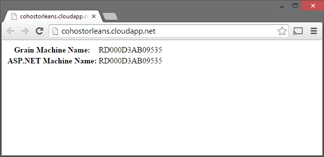

# Co-locate an Orleans Silo in an Azure Web Role

An example project showing how an Orlans Silo can be hosted on a web role. This allows smaller deployments of Orleans, as less VMs are required to deploy the minimum required infrastructure for an application (2 VMs instead of 4).

## How this works

In Azure, a Web Role is a Worker Role + IIS. Therefore a Web Role can also act as a Worker Role. The Worker Role aspect is hosted in a separate process (the web application is hosted under IIS, the worker under WaWorkerHost.exe). 

In the web project you will find a `WebRole` class which inherits `RoleEntryPoint`. This class initialises Orleans in the ususal way.

The `Global.asax.cs` file initialises the Orleans client code.

The Orleans endpoints are set up as usual.

## Security 

The Orleans endpoints are maintained as internal. However, there is slightly greater risk, as the Silo is now hosted on a machine which has an open inbound port (port 80 for HTTP). In practice, I'm not sure this makes much difference.

## License

MIT